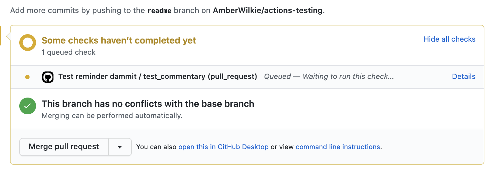
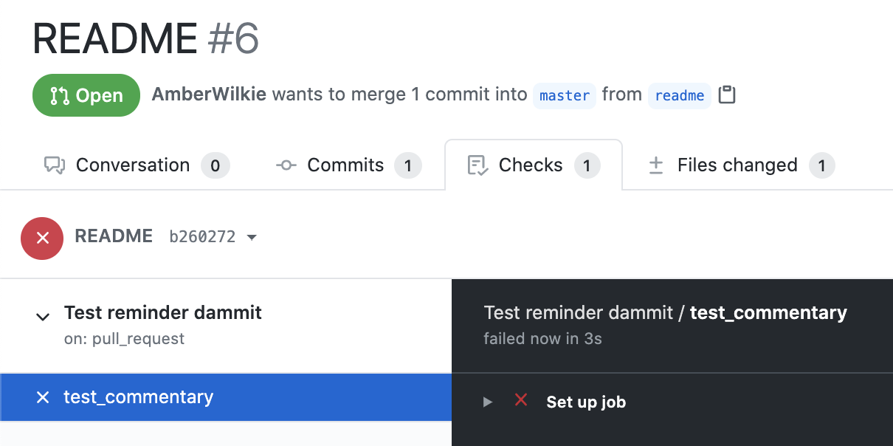

Github Actions are a new feature from everyone's favorite code tool. While they take a little getting used to,
they are very powerful tools for CI (continuous integration) and other checks on your pull requests.
Today, I'll talk about how to use Github Actions for calling webhooks. And as you know, once you 
can call a webhook, the internet is your oyster.


## Why not the old webhooks?

Now, you may be saying: "Github already has webhooks, why bother with actions?" The answer is simple: _version control_.
If you work with anyone else on your code base, you want to be able to track how changes to configuration
have come about, and who is responsible. With basic Github settings, you don't know these things - 
someone sets and configures a webhook. Maybe it fails one day, then what? With Github Actions,
you don't have to leave your text editor to see what happens when you push your code.

The other reason is that there is a world of things you can do from Github Actions; some ideas are below.
I needed webhooks for a recent project, but there are features for running tests, gathering code coverage,
linting, etc. Seeing as so many of us use Github every day, it can't hurt to get familiar with this new tool.

# Your first action

So, let's get started. The first thing you need to do is create a `.github > workflows` folder. Inside of it, we'll put our actions.
It doesn't matter what you call the file - Github will pick up all the actions you place in this special folder.

Here are the contents of my webhook file. I have a "Test pedant" API endpoint that checks the files of my 
PR and leaves a pedantic comment if I haven't written any tests.

```yaml
# This is a basic workflow that is manually triggered
name: Test reminder

# Controls when the action will run. Workflow runs when manually triggered using the UI or API.
on:
  # Trigger the workflow on push or pull request,
  # but only for the master branch
  pull_request:
    branches: [ main ]

# A workflow run is made up of one or more jobs that can run sequentially or in parallel
jobs:
  test_commentary:
    # The type of runner that the job will run on
    runs-on: ubuntu-latest

    # Steps represent a sequence of tasks that will be executed as part of the job
    steps:
    # Runs a single command using the runners shell
    - name: Webhook
      uses: distributhor/workflow-webhook
      with:
        url: "http://amberisgreat.ngrok.io/api/test_pedant"
        json: '{ "repository": "${{github.event.repository.full_name}}", "number": "${{github.event.number}}", "created_at": "${{github.event.pull_request.created_at}}", "updated_at": "${{github.event.pull_request.updated_at}}" }'
```

From top to bottom: 
* First we give a name to the action (`Test reminder`). 
* Then we specify when we want it to run (`on`). You don't have to choose branches, if you want it for all PRs, just do `on: [pull_request]`.
Github has a huge list of [events that can trigger an action](https://docs.github.com/en/actions/reference/events-that-trigger-workflows#webhook-events).
* `jobs` is a list of the jobs. Where I have `test_commentary` you would put a key for your job (it can be anything).
Your job probably runs on `ubuntu-latest` but check the job itself. A job might have multiple steps. Mine has one.
* Give your step a `name` (it can also be anything)
* `uses` refers to where the code is stored. (You can write your own actions if you want!)
* Different actions take different inputs - this one uses `with` and the input keys.

I'm using a [webhook function from "distributhor"](https://github.com/distributhor/workflow-webhook). 
Github doesn't have an official webhook job yet, but they might by the time you read this.
This action takes at least one input: `url`, the endpoint you want to hit with this action. `json` refers
to the data you are going to send.

## The Github Actions payload
This information a little tricky to hunt down in the Github Actions docs. The payload for a Github Action
is nested under `github.event`. You also need to know which action you are pushing data from - as there are various keys available on `event`
depending on which action you are referencing (listed as `action` in the payload docs). 
The relevant docs are [here](https://docs.github.com/en/developers/webhooks-and-events/webhook-events-and-payloads).

My library wouldn't let me just shove the whole `event` into my webhook - that's why you see the keys 
specifically pulled out. Maybe the action you write would take the whole `event` (and tell me about it!)

# Github Actions in... action
And that is everything you need! As long as your webhook responds with a 200, your action will get a green check.



If your action fails, you can check out what went wrong in the Actions tab. Mine fails because I don't have my ngrok tunnel running anymore.



# Bonus: how to get and use ngrok
Unrelated to this feature, it's very useful to be able to open up a locally-hosted port
for external services. In this case, I want my Github Action to trigger my localhost, so that I can test the payload
and execution of my webhook. When I put this into production, I'll replace the `url` with the production version of the code.

[Ngrok](https://ngrok.com/) to the rescue! Ngrok is a service that creates a tunnel to your localhost.
It's free, too. My company pays for a few of us to have reserved URLs (because web-to-mobile development things)
but for your purposes here, free is great. Just `brew install ngrok` (or whatever package manager you use),
spin up your localhost serving the webhook code, and `ngrok http <your-port>`. Now you've created a public connection
to your localhost. Github will be able to access it and you can test your execution. Just be aware, the free tunnels expire after a while and will require a new url.

# What now?
If this gives you some cool ideas for what you can do with changes to your Github, you ought to check out
the [Actions Marketplace](https://github.com/marketplace?type=actions).
Some very clever folks have dreamed up all kinds of things to happen when events are triggered in your Github.
Here you'll find auto-linters, Jira connections, deployment tools and much, much more. Happy actioning!
