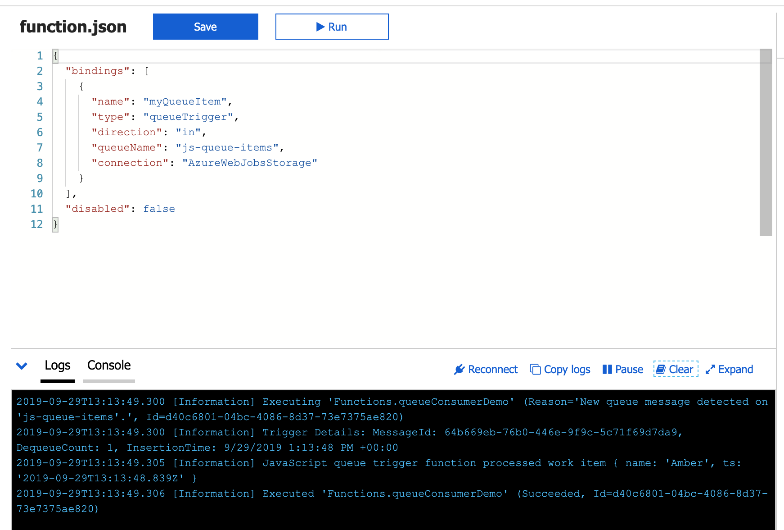

"Serverless" architecture is all the rage in tech land at the moment, including heavy usage
at my new workplace. Microsoft jumped into this space with [Azure](https://azure.microsoft.com) a while back.
Their portal, where all the services are grouped and "organized", offers so many services it feels
nearly impossible to be an expert. I'll cover __function apps, triggers, bindings, and event queues__, enough to get a web developer started on something great in the cloud.


Two months ago I had never worked with any of these technologies, but I am loving how clean,
clearly separated, and async these tools can be. Azure services have some flaws (portal speed, UI problems, 
and as you scale, difficulty in understanding what is dragging down the system) but on the whole the technology is easy to use
and very powerful.

# Function Apps
The first thing you'll do to get started is create a Function App. In Azure's world,
this is a grouping of related functionality. You will create discrete *functions* inside the *Function App*.
Each Function App has access to a storage container.


From the portal (after account setup and payment), you'll click "Create a Resource" at the very top,
and select Function App. Give your app a name, choose a language to write your code in (I chose Node for Javascript),
and keep the rest of the settings as they are.
It takes a minute to deploy a new Function App - you can click on the notification
in the upper right to watch progress and get an easy link when it's ready.

## Adding functionality
Once the Function App is ready, click the plus next to Functions. Select "In Portal editor" and
"Webhook / API". We'll be doing the most basic setup possible. CI/CD deployments and such
are outside the scope of this tutorial, but of course you can version control your work using git tools and deploy through
a pipeline.


# Bindings
After you create your function, you'll get an `index.js` and a `function.json`.
You can access these to the right of your in-portal editor under "View Files". Let's look at `function.json`
first - it's the configuration file for your function. Here's the file as the portal will spit it out:
```json
{
  "bindings": [
    {
      "authLevel": "function",
      "type": "httpTrigger",
      "direction": "in",
      "name": "req",
      "methods": [
        "get",
        "post"
      ]
    },
    {
      "type": "http",
      "direction": "out",
      "name": "res"
    }
  ],
  "disabled": false
}
```
[Bindings](https://docs.microsoft.com/en-us/azure/azure-functions/functions-triggers-bindings) 
are Azure's handy way to connect to various services and resources without needing to do a lot of setup.

### httpTrigger
* Change `authLevel` to `"anonymous"` and we won't need a key to call our function.
* The `type` is `httpTrigger` - that means we're going to generate
an endpoint we can use to call this function (more below). 
* The `direction` can be either `in` or `out` - indicating input or output to/from our function.
* The trigger will call the function with parameters supplied. We can call the binding whatever we want,
but convention says we name the input `req` for request and the output `res` for response. 
* `Methods` are how we can call this function. I'll delete `post`, as we won't need it.

The next binding is also type `http`, direction `out`, because this is how we'll send a response.
If you want to disable the function, you can do it here in the `function.json` or in the UI of the portal.

## Using bindings in the function code
We can use the example code provided by Azure to show how bindings work. I've simplified Azure's code
but you should have something very similar in your `index.js` if you're following along:
```javascript
module.exports = async function (context, req) {
    context.log('JavaScript HTTP trigger function processed a request.');

    if (req.query.name) {
        context.res = {
            // status: 200, /* Defaults to 200 */
            body: "Hello " + req.query.name
        };
    }
    else {
        context.res = {
            status: 400,
            body: "Please pass a name on the query string or in the request body"
        };
    }
};
```


Here you can see we have a simple web hook. We can watch it work quickly by clicking on "Get function URL"
and sending a request with cURL or Postman. So what's going on?


Through Azure magic, our function has been called with `context` and the `req` that we sent.
The `context` allows us access to the bindings we saw in `function.json` and the `req` becomes input for our function. 
More Azure magic handles the response. We simply set the `status` to our requirements,
and the `body` appropriately. Azure handles the rest. (Note that if you are sending JSON or other non-string response objects, you'll
have to set the headers).

We can see all this working in the logs. You'll find them at the very bottom of the page under the `index.js` code.
Note that `console.log` won't help you here - you'll need to use `context.log`.

And that's it! We have a web hook running in the "cloud".

## Env variables
We probably won't get far without having some secrets we use to connect to databases, external APIs,
and other services. You can keep those variables under "Configuration" when you click the name of your Function App 
(as opposed to Functions). Azure will automatically put a bunch in there to deal with your Function App storage
and Application Insights (monitoring).

## Other bindings
There are dozens of bindings that can be used. Azure can connect to several different types of databases,
and you can create a trigger for a new document being created. Likewise, this method could receive
a payload that would create a record with an out binding. Another interesting binding is an `event`,
which I'll cover next.

# Event queues
A request and response is great, but what if we want to create an asynchronous event from an HTTP binding?
Say we are creating a user. After that user is created, we want to send an email to welcome them to our service.
But if something is wrong with our send-email code, we would never want that to get in the way of creating a user or
responding to the customer.
We can create async messaging through an [event queue](https://docs.microsoft.com/en-us/azure/azure-functions/functions-bindings-storage-queue).

I won't get too deep into how queues work, but the idea is quite simple: one method puts messages into a line, and another
peels them off and does something with them (last in, first out). When the queue is empty, anything that listens to it is quiet.
Azure has functionality for different types of queues, including the more complex Service Bus.

## Creating the queue
The first thing we'll do is create a queue that our functions can push and read from. If you click "Home" in the breadcrumbs,
you should see your Function App name in recent resources. The link here is actually to the "Resource group" - a collection
of all the items you created with the Function App. Click in, then select your storage (it looks like a database table).
Now find the Queues tab, click "+Queue", then create a queue for your function app. Note that you can have
as many queues as you like. You can also create items in your queue manually, for testing your functions independently.


## Queue bindings

Add a new function (click the `+` icon) and select "Azure Queue Storage trigger". This will prompt
you to install an Event Hub extension, then give your function a name - you can ignore the other settings for now. 
Here's the `function.json` code for our new bindings:
```json
{
  "bindings": [
    {
      "name": "myQueueItem",
      "type": "queueTrigger",
      "direction": "in",
      "queueName": "js-queue-items",
      "connection": "AzureWebJobsStorage"
    }
  ],
  "disabled": false
}
```
We'll use the storage we created for this function app to keep a queue of events.
The `index.js` takes in the item from the queue and executes with it. We don't need to do much with our function,
so we can just keep the demo code from Azure:
```javascript
module.exports = async function (context, myQueueItem) {
    context.log('JavaScript queue trigger function processed work item', myQueueItem);
};
```



## Adding an item to the queue
Your queue trigger function is running, but it won't do anything until we add an item to our queue.
We can do this by adjusting our first function to put an item in the queue when the web hook is called.
```json
{ bindings: [...],
    {
      "name": "myQueueItem",
      "type": "queue",
      "direction": "out",
      "queueName": "js-queue-items",
      "connection": "AzureWebJobsStorage"
    }
}
```
Now we can update our code to add an item to the queue:
```javascript
[...]
    if (req.query.name) {
        context.bindings.myQueueItem = {
            name: req.query.name,
            ts: new Date()
        }
[...]
```
If you open your functions in separate windows, you can watch the whole thing happen in the logs for each function.
Send your request, watch it be consuming in the http trigger, then the queue trigger will pick up the message placed by
the first function. Cool, right?

This is some powerful stuff for creating asynchronous jobs in a way that prevents your functions from taking each other out.
In a "monolith" model, if one function misbehaves, it can prevent others from executing. In this model,
if there is something wrong with the queue trigger, it won't prevent the server from responding appropriately.
Naturally, this adds a layer of complexity and consideration that doesn't exist in a monolith - there are always trade-offs.

But if we go back to our theoretical use-case where we are creating a new user with an http trigger, image
having 10 queues to do various things. Our http trigger might create a document in the database and return success in the request.
The same job might add to a queue about sending an email, triggering a coupon SMS to send tomorrow, putting a Slack message
to a marketing team, or any of a million other things that might need to happen when a new user is created.
If any one of them fails (Slack is down?), the others go on happily on their way.

This article has only brushed the surface of what's available. I'm looking forward to exploring more of what Azure can do.
Let me know if you have some tips for what to build next!
