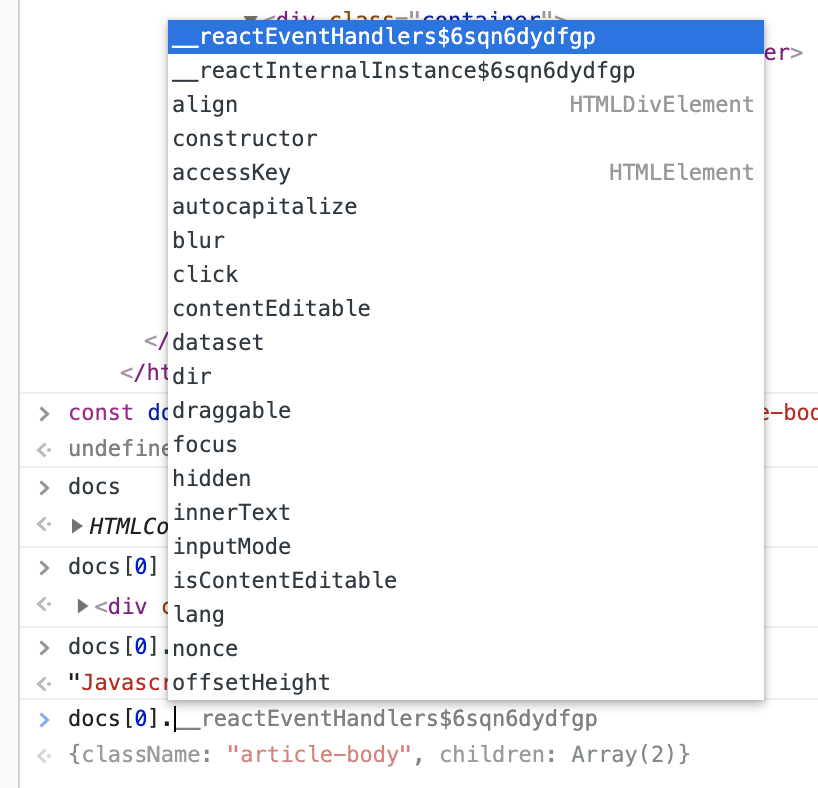

There's a lot of Javascript hate out in the world, and I believe much of it is misplaced.
Javascript is a language designed to run in a browser and manipulate the DOM. We've mangled it
into a server-side language and written tools (Node) that have gotten far from the original intent.
But unlike Ruby or Java or Python, Javascript wants to live in your browser.

This is mostly for those new to programming, struggling to understand why we are bothering
to do math or iterate through arrays or parse objects. All those things are more than necessary
if you want to be a programmer, but that's not how you learn to love the language.
Javascript is all about what you can see. The rest of it can come later.

# Take it to the DOM
The very first lesson in many tutorials for beginner programmers is something along the lines of 
"this is a variable", "this is an array" blah blah blah. Why not start off with something fun? Try this:

1. While you are viewing this website (on a computer - phone folks, you'll have to wait), pop open the console.
On a mac, it's cmd-opt-J. Or you can left-click on this text, and select inspect. At the top, you'll see some tabs.
Select console. This is where we can write Javascript that will execute in our browser.
2. In the console, type in `document` and hit enter. That document is the same as in document-object-model (DOM).
If you're in Chrome or Firefox, you'll notice the entire page highlights as you type this in.
If you click the little arrows to inspect the document, you'll see it's this page, in HTML and CSS.
We can use Javascript to manipulate these elements.
3. Type this into your console: `const elements = document.getElementsByClassName('article-body')` and hit enter.
Now you've stored a node list (it's like an array) of DOM elements with class "article-body".
4. Ok, the best part. Remember that you can refresh your page after you make these changes to reset everything.
We'll take the first element of the node list (it's the only one), and change it:
`elements[0].innerText = 'Javascript is great'`. See you after the refresh.

If you ask me, this is where the magic of Javascript lies. I used to teach programming
in a bootcamp and I'd watch students struggle through the first few weeks of boring math stuff.
But when it was time to start doing things you could actually "see", they would light up.

Chrome and other browsers will help you understand what is possible in the DOM with auto-fill.
Just start browsing through an objects "prototype" (all the stuff it is capable of doing), and click through.
As you see the web page you are experimenting with change, it will help you understand how and why
to use Javascript.

# You need ES6

# Concurrency is awesome, I promise
