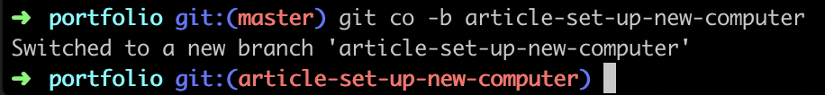
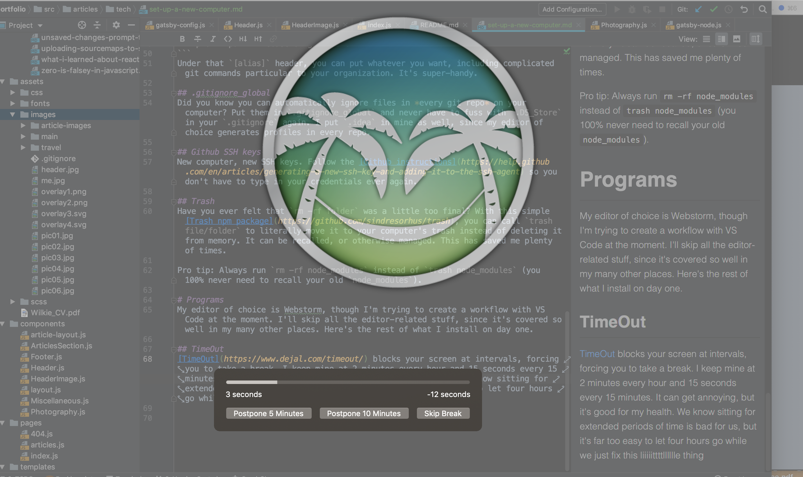

I started a new job on Monday (it's going awesome, thanks for asking) and that means a brand new, blank-slate Macbook Pro. Fortunately, I still have my old work computer (my last job maybe wasn't so wonderful, as I had to bring my own every day...). But next time, I'll probably have to turn my new work computer in, so I wanted to create a record of my setup.  Maybe it's helpful for others too!  By the way, almost all of these programs are F-R-E-E.

# The Terminal
It's absolutely essential to get your terminal set up so you can work efficiently. If you are running the default terminal with no adjustments this could save you a *lot* of time and frustration.

## iTerm2
Go on and download [iTerm2](https://iterm2.com/) and then be very pleased with all the features. My favorites are:
- Scroll (arrow keys) up and down to move through commands. Type partial commands to filter, then scroll.
- Auto-copy - just highlight text in iTerm and it will automatically be copied to the clipboard.

## oh my zsh
If you, like me, want to make your terminal work for you, get [oh my zsh](https://github.com/robbyrussell/oh-my-zsh). Here's what my terminal prompt looks like:


When I have uncommitted changes, I get a yellow x to the left of my cursor. It's really handy for recognizing that I have changes hanging out.

You can do lots of things with oh my zsh - there's a library of different ways you can style your terminal. I use theme "robbyrussel". Note that you will also want to use `.zshrc` instead of `.bashrc` for aliases and other modifications to terminal settings.

While we're here, let's give a huge shout to terminal aliases. I love the "insider" language I have with my terminal. Here are a few I put into `.zshrc`. I don't need all of them anymore, but I left them here to show some of the ridiculously long commands that can be aliased to something very short.
```
alias j-u='jest --updateSnapshot'
alias ytu='yarn test-update'
alias dcu='docker-compose up'
alias dcd='docker-compose down'
alias lint-front='docker-compose exec front yarn gulp lint'
alias back-bash='docker-compose exec back bash'
```

## .gitconfig
You probably have a `.gitconfig` on your computer, but you may not be using git aliases to save yourself some keystrokes. Here's mine:
```
# This is Git's per-user configuration file.
[user]
    name = amberwilkie
    email = amber@amberwilkie.com
[alias]
    co = checkout
    st = status
    ci = commit
    lp = log --oneline
    poh = push origin head
    rc = rebase --continue
    prom = pull --rebase origin master
```
Under that `[alias]` header, you can put whatever you want, including complicated git commands particular to your organization. It's super-handy.

## .gitignore_global
Did you know you can automatically ignore files in *every git repo* on your computer? Put them in `.gitignore_global` and never have to fuss with `.DS_Store` in your `.gitignore` again. I put `.idea` in mine as well, since my editor of choice generates profiles in every repo.

## Github SSH keys
New computer, new SSH keys. Follow the [Github instructions](https://help.github.com/en/articles/generating-a-new-ssh-key-and-adding-it-to-the-ssh-agent) so you don't have to type in your credentials ever again.

## Trash
Have you ever felt that `rm -rf folder` was a little too final? With this simple [Trash npm package](https://github.com/sindresorhus/trash), you can call `trash file/folder` to literally move it to your computer's trash instead of deleting it from memory. It can be recalled, or otherwise managed. This has saved me plenty of times.

Pro tip: Always run `rm -rf node_modules` instead of `trash node_modules` (you 100% never need to recall your old `node_modules`).

## Homebrew & Cask
If you have a mac, you already know you need [Homebrew](/usr/bin/ruby -e "$(curl -fsSL https://raw.githubusercontent.com/Homebrew/install/master/install)"
) and [Cask].(https://github.com/Homebrew/homebrew-cask) The first to install packages, the next for applications distributed in binary.
```bash
/usr/bin/ruby -e "$(curl -fsSL https://raw.githubusercontent.com/Homebrew/install/master/install)"
brew install cask
```

# Programs
My editor of choice is Webstorm, though I'm trying to create a workflow with VS Code at the moment. I'll skip all the editor-related stuff, since it's covered so well in my many other places. Here's the rest of what I install on day one.

## TimeOut
[TimeOut](https://www.dejal.com/timeout/) blocks your screen at intervals, forcing you to take a break. I keep mine at 2 minutes every hour and 15 seconds every 15 minutes. It can get annoying, but it's good for my health. We know sitting for extended periods of time is bad for us, but it's far too easy to let four hours go while we just fix this liiiiittttlllllle thing. Conveniently, my break popped up while I was writing this paragraph. (Normally the image and timer are aligned, not sure what is up with that.)

You can set the image to be whatever you want and can add text.

## gitx
I would love to install [gitx](http://gitx.frim.nl/) because I was using it extensively on my old computer. Unfortunately, it's no longer maintained! I have been experimenting with other git UIs but none of them are meeting my needs yet. More investigation is needed. If you have an older version of Mac, you might be able to get your hands on this original, extremely useful, tool. And if you can write natively, consider contributing!
GitX is extremely useful for quickly reviewing changes in your current commit and editing those changes.

## Alfred
I always install Alfred, though I honestly have not yet taken the time to fall in love. I am aware that there are a thousand features that developers use every day. It's on my productivity improvements list to figure out! I'm likely to buy the power pack so that I can access the improved clipboard, which looks awesome.
 
I was using [Clipy](https://github.com/Clipy/Clipy) before, but the visual preview of what you are going to paste seems incredibly helpful.

But whatever you do, get a damn clipboard extension! Having only one clipboard slot is impossible. How many times have you had to go back and forth between things copying and pasting? Having a better clipboard manager significantly improved my efficiency as a developer.

## Spectacle
[This program](https://www.spectacleapp.com/) allows you to snap windows to various parts of the screen. My new workplace has provided me with a baller 4k monitor, but that thing is so damn huge, when I plug it in, my windows are floating in a sea of desktop. Spectacle allows me to snap them where they belong with keyboard shortcuts. Magic!

## Giphy Capture
This may sound silly, but as a web developer who works on the front end (sometimes), I find myself needing to make short gifs to explain functionality constantly. [Giphy Capture](https://giphy.com/apps/giphycapture) is the best tool I've found for this - it's intuitive and does everything you need it to do.

And that is everything I consider core for getting to work as a web developer on a Mac! Naturally, a thousand other programs follow, as dictated by need, but these are the settings and programs I find indispensable in getting started. If you have any tips on other productivity tools that might useful, I'd love to hear.
